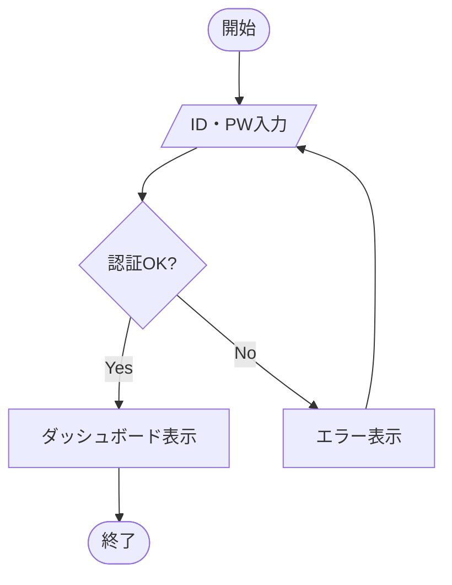

# Flowchart to Mermaid

フローチャート・ダイアグラム画像を分析し、Mermaid記法で正確に再現する。

## 依存パッケージ

このスキルの画像処理スクリプトは Python + Pillow を使用する。
初回実行時にインストールされていなければ以下を実行:

```bash
uv add install Pillow
```

## ワークフロー

### Phase 1: 画像を見て、前処理する

まず画像情報を取得する:

```bash
uv run python .claude/skills/flowchart-to-mermaid/scripts/img_info.py <input_image>
```

次に、画像をよく見る。ノードのテキスト、矢印のラベル、図の構造が **自信を持って読み取れるか？**
読み取れるならそのまま Phase 2 へ進んでよい。前処理は必須ではない。

読み取りに不安がある部分があれば、以下のツールで画像を改善できる。
**どれを使うか、どの順で使うかは画像を見て自分で判断する。**

#### 使えるツール

| スクリプト | いつ便利か |
|---|---|
| `img_resize.py --scale 2.0` | 文字が小さくて読みにくいとき。拡大して確認する最もシンプルな手段 |
| `img_crop.py --auto --margin 20` | 余白が多くて図が小さく見えるとき |
| `img_crop.py --box "x1,y1,x2,y2"` | 画像の一部だけ取り出したいとき（複数の図が1枚にあるとき等） |
| `img_crop.py --box` + `img_resize.py` | **矢印の接続先やラベルが不明瞭なとき。** 該当箇所を切り出して拡大すると確実に読み取れる |
| `img_contrast.py --auto` | 線やテキストが薄くてコントラストが弱いとき |
| `img_contrast.py --denoise` | ノイズや汚れが多いとき（写真、スキャン画像） |
| `img_contrast.py --grayscale` | カラーの背景や色ムラが邪魔なとき |
| `img_contrast.py --sharpness 1.5` | ぼやけているとき |
| `img_erode.py --mode erode` | 線を太くして見やすくしたいとき |
| `img_erode.py --mode open` | 細かいノイズ点を消したいとき |
| `img_erode.py --mode edge` | 線だけ抽出して構造を確認したいとき |
| `img_invert.py` | 背景が暗い画像を白背景に反転したいとき |

オプションは組み合わせられる。例:
```bash
uv run python .claude/skills/flowchart-to-mermaid/scripts/img_contrast.py input.png --grayscale --denoise --auto --sharpness 1.5 -o clean.png
```

出力を次の入力にすればパイプラインになる:
```bash
uv run python .claude/skills/flowchart-to-mermaid/scripts/img_resize.py input.png --scale 2.0 -o step1.png
uv run python .claude/skills/flowchart-to-mermaid/scripts/img_contrast.py step1.png --auto -o step2.png
```

#### ガイドライン

- **まず画像を見る。** ツールの出番がなければ使わなくていい。スクリーンショットのようなきれいな画像はそのままで十分なことが多い
- **読めないところがあったら、まず拡大する。** `img_resize.py --scale 2.0` は最もシンプルで確実な手段。迷ったらまず拡大
- **接続が不明瞭な箇所のcrop+拡大は Phase 2 ステップ2 で行う。** Phase 1 ではコントラスト強調やリサイズなど画像全体の前処理だけを行い、接続確認のためのcropはここではやらない。「どのノードからどのノードに繋がっているか不安」という判断は、Phase 2 ステップ1 で全体を見てから行う
- **一度に全部やろうとしない。** 1つ処理したら結果を確認して、まだ足りなければ次の処理を足す
- **やりすぎに注意。** 過剰な処理は逆効果になる。コントラスト強調しすぎると細い線が消えたり、ノイズ除去しすぎるとテキストが潰れたりする
- **複数の図が1枚に入っている場合** は、`img_crop.py --box` で個別に切り出してから、各図を別々に分析するとうまくいく。`img_info.py` のサイズ情報を手がかりに座標を見積もる
- **写真（ホワイトボード、紙のスキャン等）** はデジタル画像よりノイズが多い。`--denoise` と `--auto`（自動レベル補正）の組み合わせが効きやすい
- **手書き文字が読めないときは無理に読まない。** `[判読不能]` と書いてユーザーに聞く方が、間違った読み取りよりずっといい
- **←の接続の方向は柔軟に考える。** 局所的には、下から上、右から左に←が接続されることもある。柔軟に考え、図を読み取ること。

各スクリプトの全オプションは `references/preprocessing-recipes.md` を参照。

### Phase 2: 画像分析

**まず元画像全体を見て、全体構造を把握する。** cropから始めてはならない。

#### ステップ1: 全体構造の把握

元画像（または Phase 1 で前処理した画像）全体を見て、以下を読み取る:

1. **全体の流れ方向**: 上→下 or 左→右
    1. 局所的には、下から上、右から左に←が接続されることもあることに注意
2. **大きな分岐**: フローが何本に分かれるか、どこで分岐しどこで合流するか
3. **サブグラフ**: グループ化されている領域があるか
4. **ノード一覧**: 形状（長方形、ひし形、角丸、円、平行四辺形など）とその中のテキスト
5. **接続一覧**: 矢印の方向、ラベル（Yes/No 等）、線の種類（実線、破線、太線）。下から上への接続があることもある。

この時点で、すべてのノードと接続を一覧としてテキスト出力する。
**確信が持てない接続には `★` マークを付ける。**

```
【ノードと接続】
  survey(角丸) → consult(角丸) → evidence(角丸) → purpose{ひし形}
  purpose →|label1| cpLeft{ひし形}
  purpose →|label2| cpRight{ひし形}
  cpLeft →|label3| volDelete1[長方形]
  cpLeft →|★不明瞭| phoneNum{ひし形}    ← ★ラベルが読めない
  ...
  phoneSave → cpPhoneSuit  ← ★この接続が本当にあるか不安
```

#### ステップ2: 不安な箇所をcrop+拡大で検証する

ステップ1で `★` を付けた箇所を、crop+拡大で1箇所ずつ検証する。
`★` が無ければこのステップはスキップしてよい。

**特に以下のケースでは積極的に `★` を付けてcrop検証する:**
- 矢印が密集していて交差・重なりがある箇所
- 分岐（ひし形ノード）の周辺で、Yes/No の矢印がどこに向かっているか確信が持てないとき
- 矢印のラベルが小さすぎて読みにくいとき
- 合流点（複数の矢印が1つのノードに入る箇所）で、どの矢印がどこから来ているか判別しにくいとき
- 長い矢印が画像を横断していて、始点と終点の対応が取りづらいとき

**迷ったらcropする。間違った接続を出力するより、cropして確認する手間の方がはるかに安い。**

> **⚠️ 厳守: cropした画像を確認（Read）したら、次のツール呼び出しの前に必ず検証結果をテキスト出力せよ。メモを出力せずに次のcropに進むことを禁止する。**

```
正しい流れ:  crop → Read → ★検証メモ出力★ → 次のcrop → Read → ★検証メモ出力★
禁止の流れ:  crop → Read → crop → Read → crop → Read → まとめて分析  ← NG
```

検証メモは、ステップ1の `★` に対する回答として書く:

```
【★検証: cpLeftの右側ラベル】
  crop+拡大で確認 → ラベルは「label1」
  cpLeft →|label2| phoneNum{ひし形} に修正

【★検証: phoneSave → cpPhoneSuit の接続】
  crop+拡大で確認 → 接続あり。phoneSave[長方形] から cpPhoneSuit[長方形] へ矢印が出ている
```

#### ステップ3: 分析結果を確定する

ステップ1の一覧を、ステップ2の検証結果で更新し、最終的なノード一覧・接続一覧を確定する。この確定版が Phase 3 の入力になる。

**接続の読み取りチェック:**
- 各矢印の始点ノードと終点ノードを1本ずつ確認したか
- 分岐ノード（ひし形）から出る矢印の本数と各ラベルを確認したか
- 合流点では、入ってくる矢印の本数と各始点を確認したか
- まだ `★` が残っていないか（残っていれば追加でcrop検証する）

**読み取れない箇所があったら:**
- まず Phase 1 に戻って前処理を追加してみる（コントラスト強調など）
- それでも読めなければ `[判読不能]` や `[不明瞭: ○○に見える]` と正直に書く
- 推測が多くなりすぎたら（目安: 3箇所以上）、途中でユーザーに確認を取る

### Phase 3: Mermaid コード生成

Mermaid記法の詳細は `references/mermaid-syntax.md` を参照する。

**生成ルール:**

1. 図の種類に応じた適切なダイアグラムタイプを選択:
   - フローチャート → `flowchart TD` or `flowchart LR`
   - シーケンス図 → `sequenceDiagram`
   - 状態遷移図 → `stateDiagram-v2`

2. ノードIDは意味のある短い英語名にする（`A`, `B` ではなく `start`, `validate`, `process` など）

3. ノード形状を正確にマッピング:
   - 長方形: `[テキスト]`
   - 角丸: `(テキスト)`
   - ひし形（判断）: `{テキスト}`
   - 円: `((テキスト))`
   - 平行四辺形（入出力）: `[/テキスト/]`
   - スタジアム型: `([テキスト])`

4. 接続ラベルは `-->|ラベル|` 形式で付与

5. サブグラフがあれば `subgraph` で囲む

### Phase 4: 検証

生成したMermaidコードを元画像と照合して検証する:

- [ ] すべてのノードが含まれているか
- [ ] すべての接続が正しい方向で含まれているか
- [ ] 分岐条件のラベルが正確か
- [ ] ノード形状が元図と一致しているか
- [ ] 全体のフロー方向が一致しているか

不足や誤りがあれば修正する。

## 出力フォーマット

最終出力は以下の形式で提供する:

1. **分析結果**: 読み取ったノードと接続の一覧（確認用）
2. **Mermaid コード**: フェンス付きコードブロック
3. **注記**: 読み取れなかった箇所や推測した箇所があれば明記

複数の図を個別に変換した場合は、図ごとにこの3点を繰り返す。

読み取りに不確実な箇所がある場合は注記で正直に伝える:
- `[判読不能]` — 読めなかった箇所。ユーザーに確認を求める
- `[不明瞭: ○○に見える]` — 最善の推測を添えた箇所

## 例

**入力:** 簡単なログインフローの画像

**出力:**



## スクリプト一覧

| スクリプト | 機能 | 主なオプション |
|---|---|---|
| `scripts/img_info.py` | 画像情報を表示 | なし |
| `scripts/img_resize.py` | リサイズ | `--scale`, `--width`, `--height` |
| `scripts/img_crop.py` | クロップ | `--box "x1,y1,x2,y2"`, `--margin` |
| `scripts/img_contrast.py` | コントラスト強調 | `--factor`, `--denoise`, `--auto` |
| `scripts/img_erode.py` | エッジ強調（膨張/収縮） | `--mode`, `--iterations`, `--kernel` |
| `scripts/img_invert.py` | 白黒・色反転 | `--grayscale` |

すべてのスクリプトは `uv run python scripts/<name>.py <input> -o <output>` の形式で使用する。
`-o` を省略するとファイル名に `_processed` を付加して保存する。
