# Mermaid フローチャート構文リファレンス

フローチャート画像から Mermaid コードを生成する際の構文ガイド。

## 目次

1. [ダイアグラムタイプの選択](#ダイアグラムタイプの選択)
2. [フローチャート構文](#フローチャート構文)
3. [ノード形状](#ノード形状)
4. [接続（エッジ）](#接続エッジ)
5. [サブグラフ](#サブグラフ)
6. [スタイリング](#スタイリング)
7. [シーケンス図](#シーケンス図)
8. [状態遷移図](#状態遷移図)
9. [よくあるパターン](#よくあるパターン)

---

## ダイアグラムタイプの選択

| 元画像の特徴 | Mermaid タイプ |
|---|---|
| 箱と矢印のフロー図 | `flowchart TD` or `LR` |
| 時系列のやりとり（メッセージング） | `sequenceDiagram` |
| 状態と遷移の図 | `stateDiagram-v2` |

## フローチャート構文

### 方向

```mermaid
flowchart TD   %% Top → Down (上から下)
flowchart LR   %% Left → Right (左から右)
flowchart BT   %% Bottom → Top (下から上)
flowchart RL   %% Right → Left (右から左)
```

### ノード形状

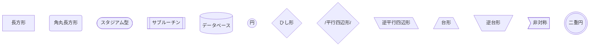

### 形状と意味の対応

| 形状 | 構文 | 意味 |
|---|---|---|
| 長方形 | `[text]` | 処理・アクション |
| ひし形 | `{text}` | 判断・分岐 |
| 角丸 | `(text)` | 汎用ノード |
| スタジアム | `([text])` | 開始・終了 |
| 平行四辺形 | `[/text/]` | 入出力 |
| データベース | `[(text)]` | データストア |
| 円 | `((text))` | 接続子 |
| サブルーチン | `[[text]]` | サブプロセス |

## 接続（エッジ）

### 基本

```mermaid
flowchart LR
    A --> B           %% 矢印
    C --- D           %% 線のみ
    E -.- F           %% 破線
    G -.-> H          %% 破線矢印
    I ==> J           %% 太線矢印
    K <--> L          %% 双方向矢印
```

### ラベル付き

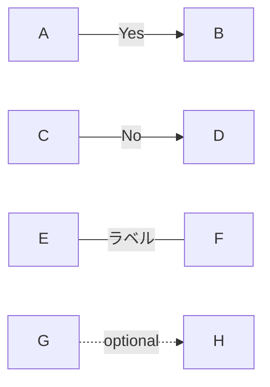

### 接続の長さ（特殊）

```
--->     少し長い
---->    もっと長い
```

## サブグラフ

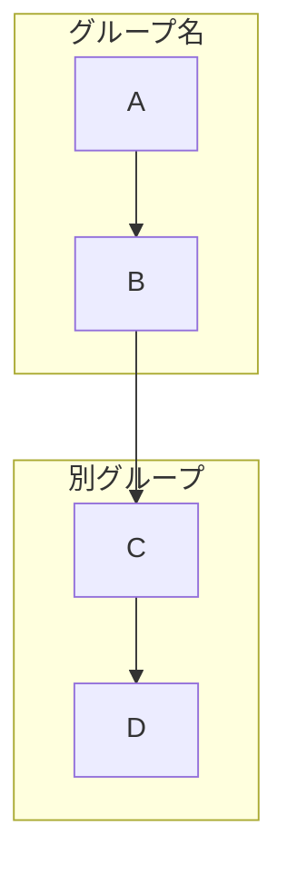

サブグラフの入れ子も可能:

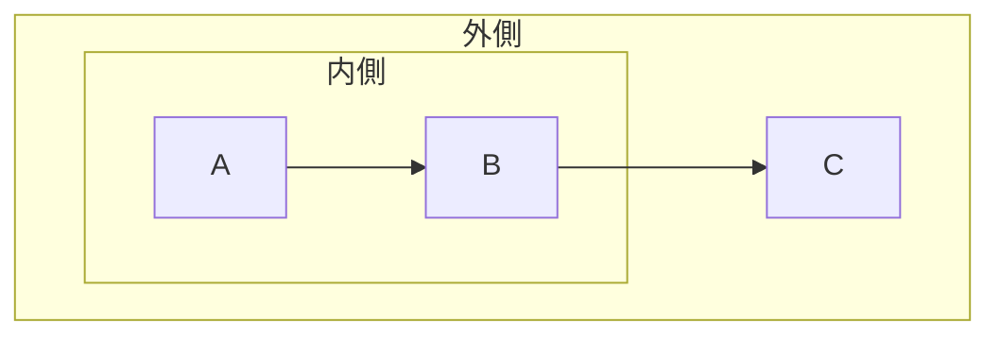

## スタイリング

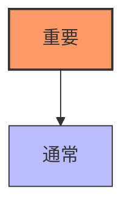

クラス定義:

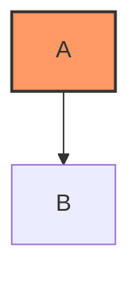

## シーケンス図

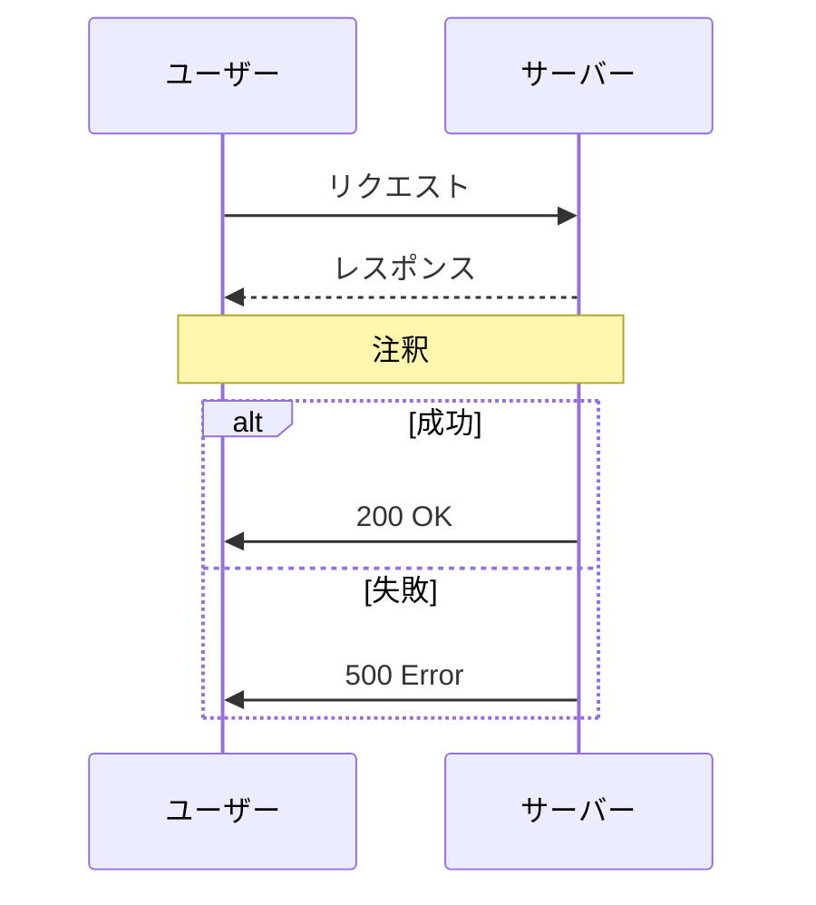

## 状態遷移図

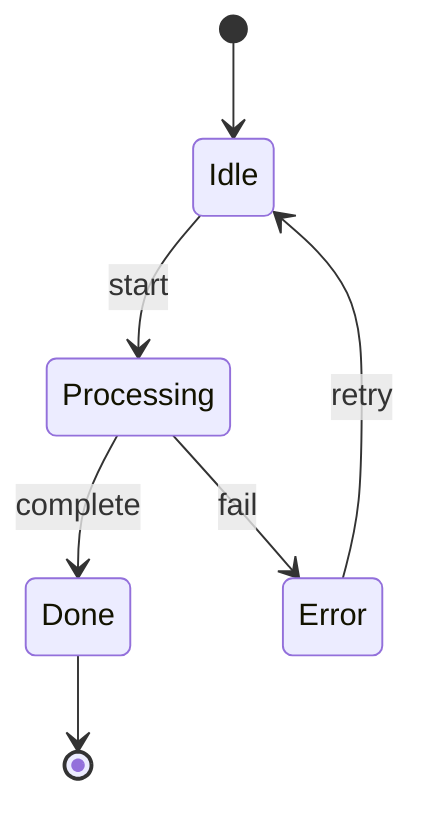

## よくあるパターン

### 分岐と合流

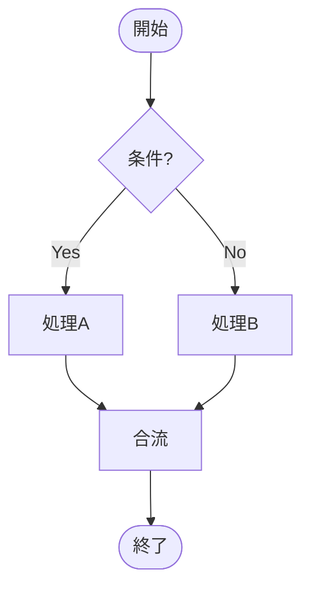

### ループ

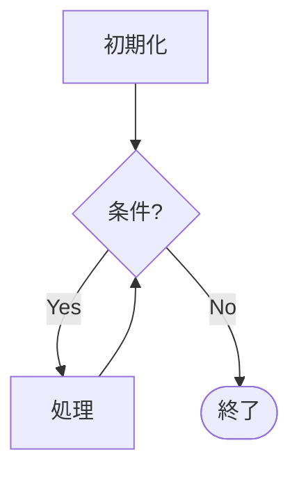

### エラーハンドリング

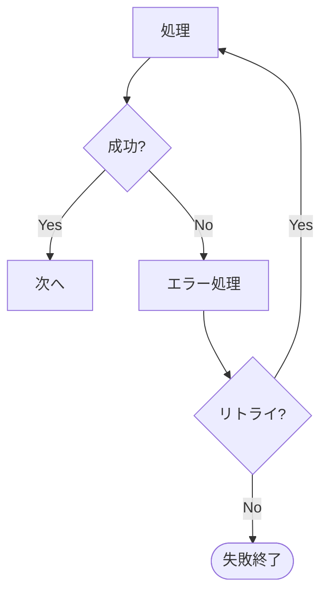

### 並列処理

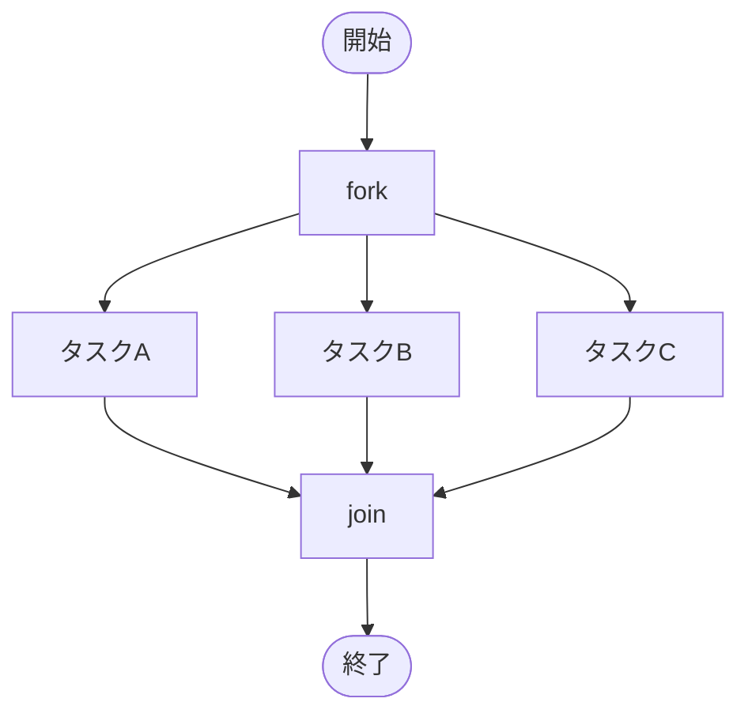
