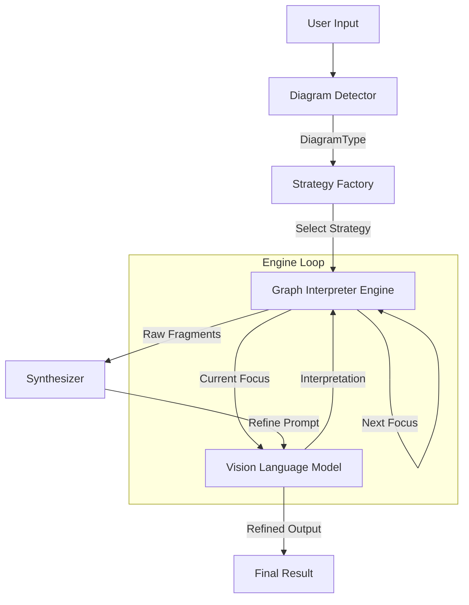

# Architecture

GraphSight は、拡張性と精度を両立するために **"Engine + Strategy"** パターンを採用しています。

## 全体フロー

## コンポーネント解説

### 1. Diagram Detector

入力された画像全体を解析し、それが「フローチャート」なのか「シーケンス図」なのかを判定します。この結果に基づいて、適切な解釈戦略（Strategy）が選択されます。

### 2. Strategy (e.g., FlowchartStrategy)

図版の種類ごとに特化した「読み解きロジック」です。

* **Mermaid Mode:** ノード間の接続関係（矢印）を厳密な構文で抽出するようにAIに指示します。
* **Natural Language Mode:** 遷移の条件やビジネスロジックを物語として抽出するように指示します。

### 3. Graph Interpreter Engine

汎用的なループ処理エンジンです。

* 「現在地」と「訪問済みリスト」を管理します。
* AIが発見した「次の着目点（Next Focus）」をキューに入れ、探索が終わるまでループを回します。

### 4. Synthesizer (Synthesis)

ループで得られた断片的な情報を統合します。

1. **Mechanical Synthesis (Raw):** すべてのステップの出力を単純結合します。抜け漏れの確認用です。
2. **AI Refinement (Refined):** 全ステップの「思考ログ（Reasoning）」と「抽出テキスト」を再度 AI に渡し、整合性の取れた一つの成果物（コードまたは文章）に書き直させます。

